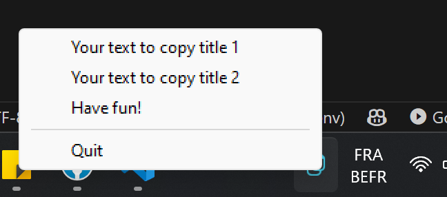

## 📋 Table of Contents

1. ✨ [What is PyPaste ?](#what-is-this)
2. 🛠️ [Quick start](#installation)

## <a name="what-is-this">✨ What is PyPaste ?</a>

PyPaste is a system tray application for Windows designed to provide quick copy-paste shortcuts. It allows users to easily manage and access frequently used text snippets through a convenient systray icon.



## <a name="installation">🛠️ Quick start</a>

### Prerequisites

- Python installed on your system.

### Setup

```batch
pip install -r requirements.txt
```

Create a "values.json" file on root folder corresponding to "\_values.json" template to add your own custom copy paste items

**Example `values.json`**

```json
[
  {
    "title": "Your text to copy title 1",
    "text": "your text to copy"
  },
  {
    "title": "Your text to copy title 2",
    "text": "your text to copy"
  },
  {
    "title": "Have fun!",
    "text": "your text to copy"
  }
]
```

This file allows you to define multiple items, each with a `title` for easy identification and the corresponding `text` to be copied when selected.
